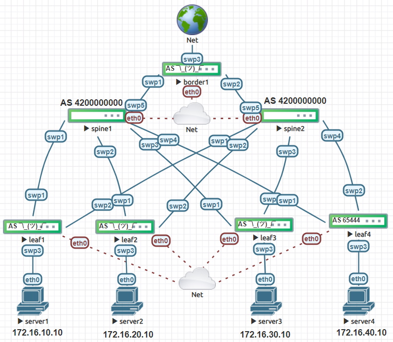

# Cumulus Auto BGP Spine Leaf with Ansible



## Purpose

This project stemmed from my curiosity with Cumulus Linux which is an open source network OS. Being linux, this OS opens itself up to using automation procedures that have been around for much longer than our traditional networking devices. This makes Cumulus pair well with Ansible. 

The roots of Ansible started with server administration/automation. This repo takes a lot of inspiration from the book [Cloud Native Data Center](https://cumulusnetworks.com/lp/cloud-native-data-center-networking/) by Dinesh Dutt. I highly recommend you read his book and check out the associated [git repo](https://github.com/ddutt/cloud-native-data-center-networking). This deployment will utilize Auto BGP, BGP unnumbered, and a spine leaf architecture.

## Prerequisites

1. Ansible ≤ 2.9
2. CumulusVX ≤ 4.2.0
3. Validate Ansible control machine has access to nodes
4. If not installed you may need to run `apt-get install sshpass`

## Project Structure

```
juliopdx@librenms:~/repos$ tree ansible_cumulus_clos/
ansible_cumulus_clos/
├── ansible.cfg
├── deploy.yaml
├── group_vars
├── hosts
├── host_vars
│   ├── border1.yaml
│   ├── leaf1.yaml
│   ├── leaf2.yaml
│   ├── leaf3.yaml
│   ├── leaf4.yaml
│   ├── spine1.yaml
│   └── spine2.yaml
├── readme.md
└── roles
    ├── deploy_services
    │   ├── files
    │   │   ├── banner
    │   │   └── motd
    │   └── tasks
    │       └── main.yaml
    ├── frr_config
    │   ├── tasks
    │   │   └── main.yaml
    │   └── templates
    │       └── frr.j2
    ├── interfaces
    │   ├── tasks
    │   │   └── main.yaml
    │   └── templates
    │       └── interfaces.j2
    └── restart_switches
        └── tasks
            └── main.yaml
```

### `hosts`

```
locahost
[network]
spine1 ansible_host=192.168.10.91
spine2 ansible_host=192.168.10.89
leaf1 ansible_host=192.168.10.95
leaf2 ansible_host=192.168.10.96
leaf3 ansible_host=192.168.10.97
leaf4 ansible_host=192.168.10.98
border1 ansible_host=192.168.10.100

[network:vars]
ansible_user=cumulus
ansible_ssh_pass=linuxlove
ansible_sudo_pass=linuxlove
ansible_become=yes

[spines]
spine1
spine2

[leafs]
leaf1
leaf2
leaf3
leaf4

[borders]
border1
```

## Roles

## deploy_services

This role was created as a place to store common services on a node. This could be setting MOTD logins, hostname, syslog, ntp, etc.

### `roles/deploy_services/tasks/main.yaml`

Credit to the folks at Cumulus for these snippets, check them out at https://github.com/CumulusNetworks/ansible_snippets

Please note, a few of these are fairly old and the file placements may have changed.

```yaml
--snip--
- name: Configure MOTD
  copy: src=./files/motd dest=/etc/motd

- name: Configure Login Warning Message (Banner)
  copy: src=./files/banner dest=/etc/issue.net

- name: Enable Usage of Banner by SSH
  lineinfile: dest=/etc/ssh/sshd_config line="Banner /etc/issue.net" regexp=^.*Banner

- name: Restart SSH Daemon
  service: name=ssh state=restarted
```
## interfaces

### `roles/interfaces/tasks/main.yaml`

This role will enable the required interfaces, set VLANs, and SVIs. Since we are using BGP unnumbered, the only IP address we need to define to establish neighbors is the loopback0 interface. BGP unnumbered will borrow the loopback IP when establishing neighbors. This greatly reduces the amount of IP addresses to use.

```yaml
- name: send interfaces config to remote
  template:
    src: ./templates/interfaces.j2
    dest: /etc/network/interfaces
```

Thats about it... but seriously, here is the `interfaces.j2` file.

```jinja
# This file describes the network interfaces available on your system
# and how to activate them. For more information, see interfaces(5).

source /etc/network/interfaces.d/*.intf

# The loopback network interface
auto lo
iface lo inet loopback
    # The primary network interface
    address {{ loopbacks.loopback0 }}

# The primary network interface
auto eth0
iface eth0 inet dhcp
    vrf mgmt



auto {{ interface.id }}
iface {{ interface.id }}

    address {{ interface.ipv4 }}
    vlan-id {{ interface.vlan }}
    vlan-raw-device bridge


    bridge-access {{ interface.vlan }}


    bridge-ports {{ interface.bridge_ports }}
    bridge-vids {{ interface.bridge_vids }}
    bridge-vlan-aware yes





auto mgmt
iface mgmt
    address 127.0.0.1/8
    address ::1/128
    vrf-table auto
```

This is the output from `leaf1.yaml`.

```yaml
hostname: leaf1

loopbacks:
  loopback0: 10.0.0.3/32

bgp:
  asn: leaf
  neighbors:
    - swp1
    - swp2
    
route_maps:

  - name: EXCEPT_ISL_ETH0
    redistribute: True
    permits:
      - name: permit 10
        match: interface lo
      - name: permit 20
        match: interface vlan10

interfaces:

  - id: swp1
    enabled: True
    bridge_port: False
    ipv4:
    
  - id: swp2
    enabled: True
    bridge_port: False
    ipv4:

  - id: swp3
    enabled: True
    bridge_port: True
    ipv4:
    vlan: 10
    
  - id: vlan10
    enabled: True
    bridge_port: False
    port: swp3
    vlan: 10
    ipv4: 172.16.10.1/24
    bridge_vid: True
   
  - id: bridge
    enabled: True
    bridge_ports: swp3
    bridge_vids: 10
    bridge_port: False
    ipv4:
```

Both of these combined will render the following file:

```
# This file describes the network interfaces available on your system
# and how to activate them. For more information, see interfaces(5).

source /etc/network/interfaces.d/*.intf

# The loopback network interface
auto lo
iface lo inet loopback
    # The primary network interface
    address 10.0.0.3/32

# The primary network interface
auto eth0
iface eth0 inet dhcp
    vrf mgmt

auto swp1
iface swp1

auto swp2
iface swp2

auto swp3
iface swp3
    bridge-access 10

auto vlan10
iface vlan10
    address 172.16.10.1/24
    vlan-id 10
    vlan-raw-device bridge

auto bridge
iface bridge
    bridge-ports swp3
    bridge-vids 10
    bridge-vlan-aware yes


auto mgmt
iface mgmt
    address 127.0.0.1/8
    address ::1/128
    vrf-table auto
```

## frr_config

This role has a few interesting aspects to it. We will be using a new nerd knob that Cumulus Linux has added to version 4.2, Auto BGP! Auto BGP simplifies the use of BGP by automatically assigning the AS within 4200000000-4294967294. This private range is defined in [RFC 6996](https://tools.ietf.org/html/rfc6996). The AS is assigned by using a hash of your switch MAC. Each spine will be assigned AS 4200000000.

Enabling Auto BGP is as easy as running the following.

`net add bgp autonomous-system leaf | spine | 1-4294967295`

When automating some bgp variable to be used later, it would look something like this:

```yaml
bgp:
  asn: 65444
  neighbors:
    - swp1
    - swp2
```

Where the AS will be statically defined. Since we are using Auto BGP, the value can be anything within the range defined above. The solution for this wasn't too bad. In short, I defined the AS as either `leaf` or `spine` in the hostvars file. 

This will enable the playbook to run the defined commands on the node. The playbook also allows the AS to be statically defined. Auto BGP is compatible with traditionally setting BGP with remote neighbors.

Snip from `leaf1.yaml`

```yaml
hostname: leaf1

loopbacks:
  loopback0: 10.0.0.3/32

bgp:
  asn: leaf
  neighbors:
    - swp1
    - swp2
--snip--
```

### `roles/frr_config/tasks/main.yaml`

This playbook will use the [nclu](https://docs.ansible.com/ansible/latest/modules/nclu_module.html) module to set the BGP AS and turn on the frr daemon. For example, if the AS variable was `65444`, then the module would run `net add bgp autonomous-system 65444` and if the variable was `leaf`, the command would be `net add bgp autonomous-system leaf`.

Here is the next oddity... how do we grab the new dynamically assigned AS?

This wasnt too bad with a little trial and error. We use a traditional Ansiblism... `register` and then `set_fact` :)

We will use the shell module to get the bgp output and grep for what we need. `grep -Eo "([42].........)"`, -Eo will enable extended grep and match only what we want vs what is on the line. I know this is kind of a hack but if there is something easier, please let me know. The end just matches on 42 and then however many digits after. We know from the range that the digit count will always be the same.

```yaml
- name: add bgp to device
  nclu:
    commands:
        - add bgp autonomous-system {{ bgp.asn }}
    commit: true

- name: running grep on show bgp to only grab current AS
  shell: net show bgp json | grep -Eo "([42].........)"
  register: bgp_status
  when: bgp.asn == 'leaf' or bgp.asn == 'spine'

# I am not good at regex, this took some research/ trial
# and error. If there is a better solution please let me know!

- name: setting current auto BGP AS variable
  set_fact:
    bgp_auto: "{{ bgp_status.stdout_lines.0 }}"
  when: bgp.asn == 'leaf' or bgp.asn == 'spine'

- name: send frr config to remote
  template:
    src: ./templates/frr.j2
    dest: /etc/frr/frr.conf
```

Snip rom `frr.j2`

```jinja
hostname {{ hostname }}
log syslog informational
zebra nexthop proto only
service integrated-vtysh-config

router bgp {{ bgp_auto }}

router bgp {{ bgp.asn }}

 bgp router-id {{ loopbacks.loopback0 | ipv4('address') }}
```

Please note, if bgp_auto is defined, set as that. Else, set it as what is defined. The rest of the role just sets the extra bits for the border leaf to do some NAT and allow the servers to ping some 8.8.8.8

## restart_switches

Restarts switches... and waits :) 

## Playbook Output!!!

[](https://asciinema.org/a/y2lb86thAbNWu4OuwvUsrVCTW?speed=2)